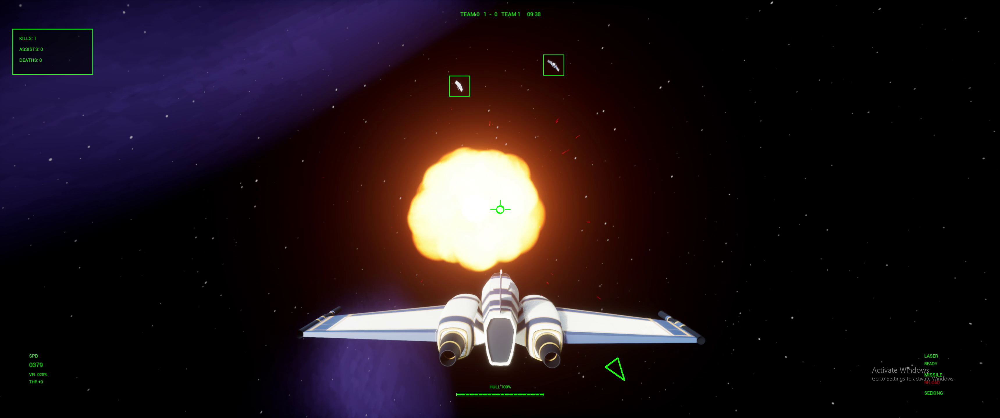
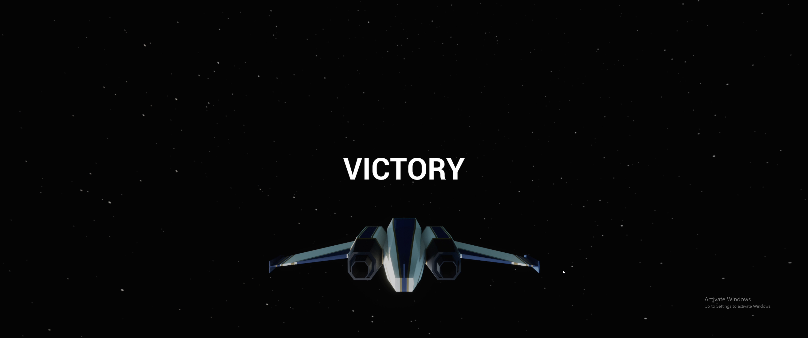
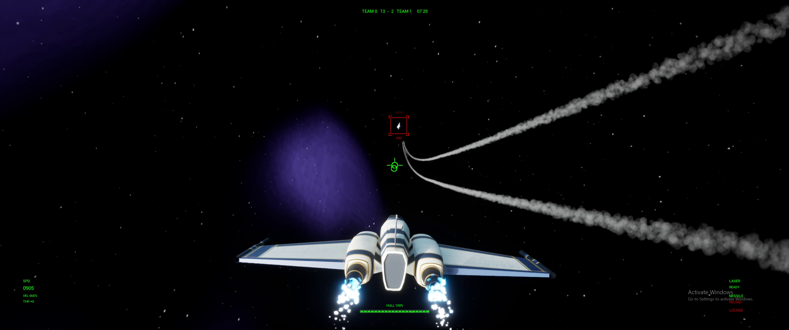
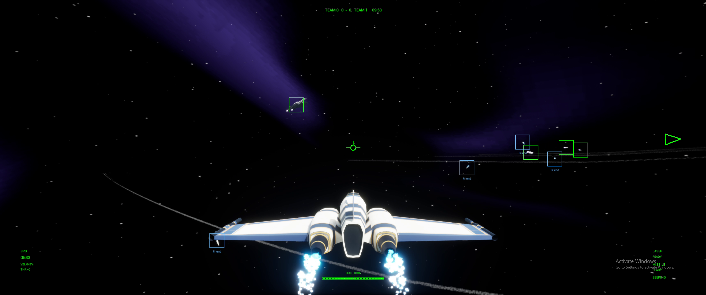
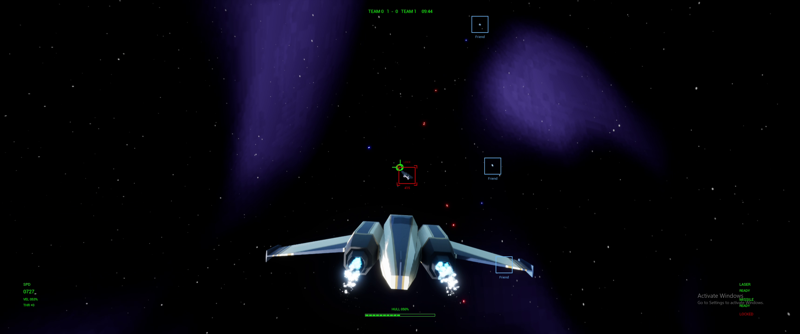
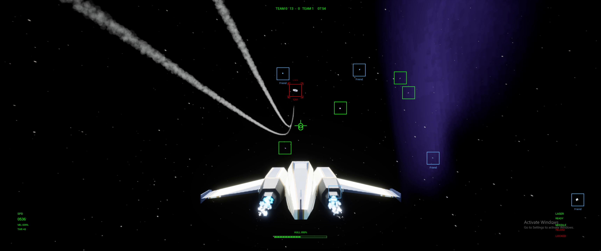

# Project Intercept

A space-combat game built in **Unreal Engine 5 with C++ and Blueprints**, featuring AI dogfights, target tracking, homing missiles, and battles alongside friendly ships.

**Developer:** Samuel Mok · **Focus:** Gameplay programming · **Status:** In active development

This portfolio repository contains selected C++ source code and gameplay footage for review. The full game project and assets are private; this source selection is not a standalone buildable game. Some referenced project classes and assets are intentionally outside this selection.

**Updated October 6, 2026:** Refreshed source samples from the current development project, with new screenshots and clips from two gameplay recordings.

## What I Built

I designed and implemented the following gameplay systems:

- **Flight and ship systems:** Player controls, shared spacecraft behaviour, health, and damage.
- **Combat AI:** State-based dogfighting with patrol, pursuit, break-off, and search behaviours.
- **Targeting and weapons:** Target acquisition and cycling, timed missile lock-on, homing missiles, laser weapons, and configurable secondary weapons.
- **Projectile management:** Reusable laser and missile pools with activation, collision, and return-to-pool lifecycles.
- **Battle systems:** Capital ship and turret behaviour, plus centralized combatant tracking through an Unreal subsystem.

## Code Highlights

Start with targeting, AI, or weapons to see how the core combat systems are organized.

| System | Implementation | What to look for |
| --- | --- | --- |
| Targeting | [TargetingComponent.cpp](Source/SpaceAce/Components/TargetingComponent.cpp) | Target acquisition, cycling, and timed missile lock-on. |
| Combat AI | [ShipAIController.cpp](Source/SpaceAce/Controllers/ShipAIController.cpp) · [ShipAIState.cpp](Source/SpaceAce/AIStates/ShipAIState.cpp) | Combat decisions and transitions between dogfighting states. |
| Weapons and pooling | [MissileWeaponComponent.cpp](Source/SpaceAce/Components/MissileWeaponComponent.cpp) · [LaserWeaponComponent.cpp](Source/SpaceAce/Components/LaserWeaponComponent.cpp) | Weapon firing, secondary-weapon profiles, ammunition, and reusable projectile pools. |
| Projectile behaviour | [MissileProjectile.cpp](Source/SpaceAce/Projectiles/MissileProjectile.cpp) · [LaserProjectile.cpp](Source/SpaceAce/Projectiles/LaserProjectile.cpp) | Homing, movement, collision, damage, and projectile lifecycle handling. |
| Ship systems | [ShipBase.cpp](Source/SpaceAce/Ships/ShipBase.cpp) · [PlayerShip.cpp](Source/SpaceAce/Ships/PlayerShip.cpp) | Shared ship behaviour and player-specific flight controls. |
| Battle coordination | [CombatantSubsystem.cpp](Source/SpaceAce/Subsystems/CombatantSubsystem.cpp) · [CapitalShipBase.cpp](Source/SpaceAce/Ships/CapitalShipBase.cpp) | Combatant registration and capital ship behaviour. |

## Gameplay Clips

Three short clips from the October 6 recordings, with original resolution and audio. Open a clip using its title or preview image.

| Clip | Preview | Length |
| --- | --- | --- |
| [Missile attack and explosion — recording 1](Media/Clips/01_Recording_1_Missile_attack.mp4) |  | 12 seconds |
| [Final attack and victory — recording 2](Media/Clips/02_Recording_2_Final_attack_and_victory.mp4) |  | 12 seconds |
| [Missile highlights — both recordings](Media/Clips/03_Both_recordings_Missile_highlights.mp4) |  | 12 seconds: 6 from each recording |

## Gameplay Screenshots

Three full-resolution screenshots from each recording. Select an image to open it.

| Recording 1 | Recording 2 |
| --- | --- |
| **Engine exhaust** | **Engine exhaust** |
|  |  |
| **Close explosion** | **Curving missiles** |
|  |  |
| **Missile pursuit** | **Victory** |
|  |  |

## Technology

C++ · Unreal Engine 5 · Unreal Gameplay Framework · Blueprints · Niagara · Git

The Unreal module retains the project's original internal name, `SpaceAce`.

## Portfolio Notice

Source code is provided for portfolio and code-review purposes only.

© 2026 Samuel Mok. All rights reserved.
