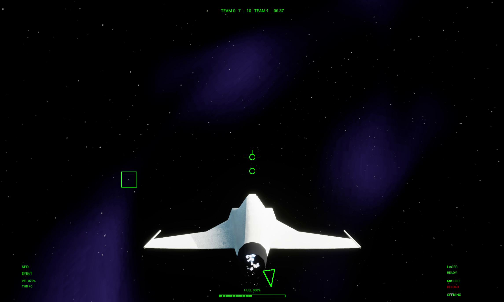
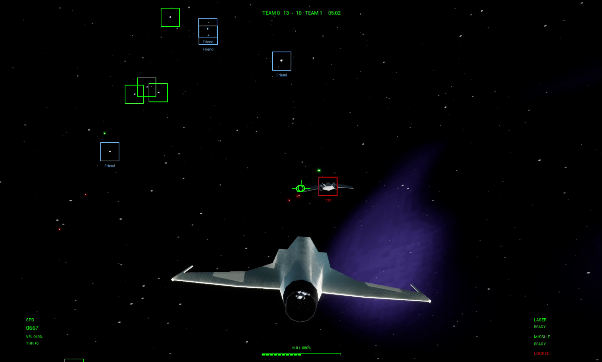
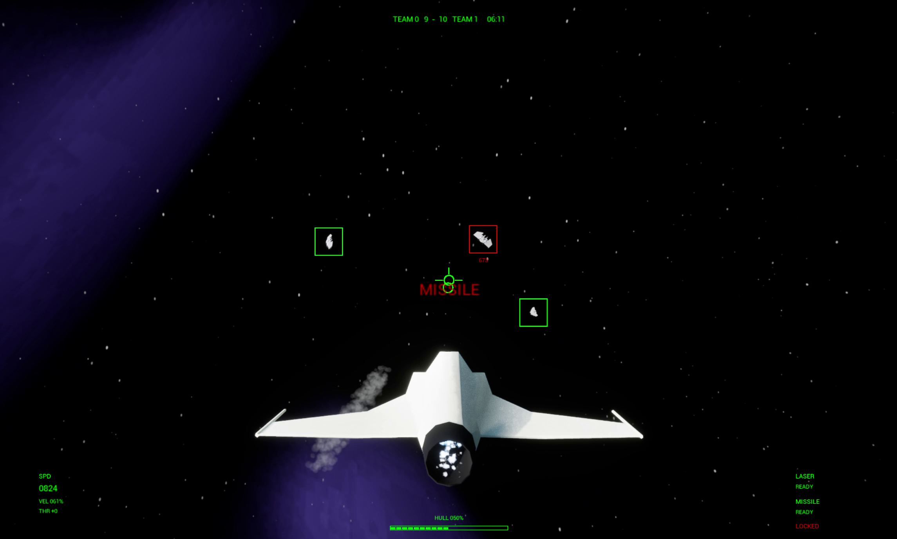
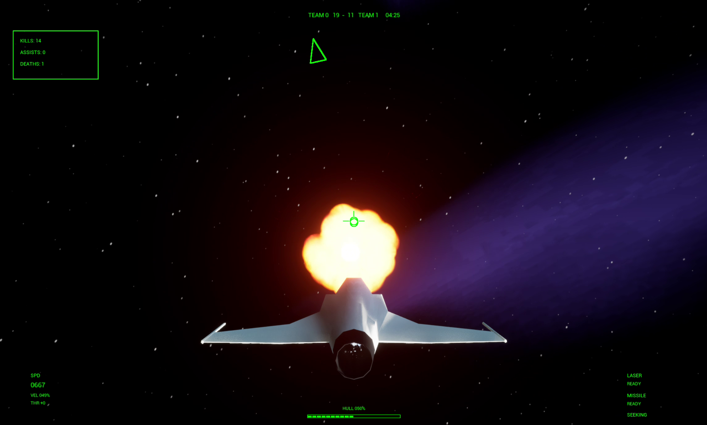

# Project Intercept

A single-player space-combat game built in **Unreal Engine 5 with C++ and Blueprints**, featuring AI dogfights, target tracking, missile combat, and battles alongside friendly ships.

**Developer:** Samuel Mok · **Focus:** Gameplay programming · **Status:** In active development

This portfolio repository contains selected C++ source code for review. The full game project and assets are private; this source selection is not a standalone buildable game.

## What I Built

I designed and implemented the following gameplay systems:

- **Flight and ship systems:** Player controls, shared spacecraft behaviour, health, and damage.
- **Combat AI:** State-based dogfighting with patrol, pursuit, break-off, and search behaviours.
- **Targeting and weapons:** Target acquisition and cycling, missile lock-on, homing missiles, and laser weapons.
- **Projectile management:** Reusable laser and missile pools with activation, collision, and return-to-pool lifecycles.
- **Battle systems:** Capital ship and turret behaviour, plus centralized combatant tracking through an Unreal subsystem.

## Code Highlights

Start with targeting, AI, or weapons to see how the core combat systems are organized.

| System | Implementation | What to look for |
| --- | --- | --- |
| Targeting | [TargetingComponent.cpp](Source/SpaceAce/Components/TargetingComponent.cpp) | Target acquisition, cycling, and timed missile lock-on. |
| Combat AI | [ShipAIController.cpp](Source/SpaceAce/Controllers/ShipAIController.cpp) · [ShipAIState.cpp](Source/SpaceAce/AIStates/ShipAIState.cpp) | Combat decisions and transitions between dogfighting states. |
| Weapons and pooling | [MissileWeaponComponent.cpp](Source/SpaceAce/Components/MissileWeaponComponent.cpp) · [LaserWeaponComponent.cpp](Source/SpaceAce/Components/LaserWeaponComponent.cpp) | Weapon firing and reusable projectile pools, with settings exposed to Blueprints. |
| Projectile behaviour | [MissileProjectile.cpp](Source/SpaceAce/Projectiles/MissileProjectile.cpp) · [LaserProjectile.cpp](Source/SpaceAce/Projectiles/LaserProjectile.cpp) | Homing, movement, collision, damage, and projectile lifecycle handling. |
| Ship systems | [ShipBase.cpp](Source/SpaceAce/Ships/ShipBase.cpp) · [PlayerShip.cpp](Source/SpaceAce/Ships/PlayerShip.cpp) | Shared ship behaviour and player-specific flight controls. |
| Battle coordination | [CombatantSubsystem.cpp](Source/SpaceAce/Subsystems/CombatantSubsystem.cpp) · [CapitalShipBase.cpp](Source/SpaceAce/Ships/CapitalShipBase.cpp) | Combatant registration and capital ship behaviour. |

## Gameplay Screenshots

Screenshots from the development build. Select an image to view it at full resolution.

| Dogfight / Targeting | Friendlies in Combat |
| --- | --- |
|  |  |
| **Missile Warning** | **Explosion** |
|  |  |

## Technology

C++ · Unreal Engine 5 · Unreal Gameplay Framework · Blueprints · Niagara · Git

The Unreal module retains the project's original internal name, `SpaceAce`.

## Portfolio Notice

Source code is provided for portfolio and code-review purposes only.

© 2026 Samuel Mok. All rights reserved.
